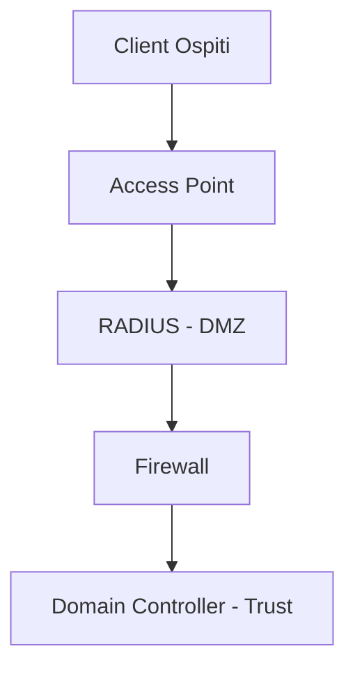
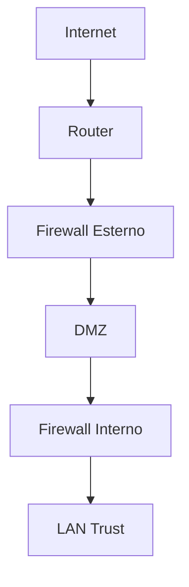
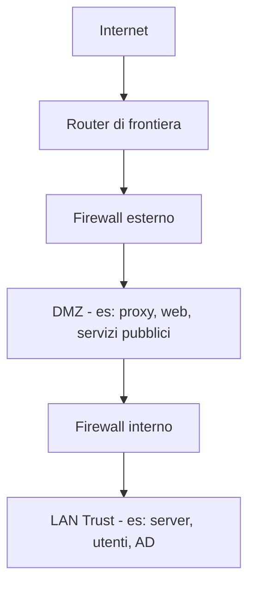

# 1. Posizionamento di un Server RADIUS

- [Wikipedia](https://it.wikipedia.org/wiki/RADIUS)

Il server **RADIUS** gestisce l’autenticazione degli utenti (es. Wi-Fi aziendale o rete ospiti).
Il suo posizionamento influisce direttamente sulla sicurezza dell’infrastruttura.

[server radius](https://cyberhoot.com/wp-content/uploads/2020/01/RADIUS.gif)

## 1.1 Livelli di fiducia della rete

Una rete aziendale è generalmente divisa in:

- **Untrust** $\rightarrow$ Internet
- **DMZ** $\rightarrow$ zona intermedia
- **Trust** $\rightarrow$ LAN interna
- **Guest Network** $\rightarrow$ rete ospiti (basso trust)

La rete ospiti deve essere sempre considerata **potenzialmente ostile**.

## 1.2 RADIUS nella LAN Trust (problema)

Inserire un RADIUS per la rete ospiti nella LAN interna è sconsigliato perché:

- richiede apertura firewall verso la rete sicura (UDP 1812–1813);
- aumenta la superficie di attacco;
- permette **lateral movement** in caso di compromissione.

Se il servizio RADIUS viene violato, l’attaccante si trova già nella rete aziendale.

## 1.3 Database di autenticazione

Il RADIUS verifica le credenziali interrogando:

- Active Directory
- LDAP
- Database SQL

Vantaggi dell’autenticazione RADIUS:

- identificazione precisa dell’utente;
- tracciabilità accessi;
- supporto a auditing e GDPR.

## 1.4 Architettura consigliata

Approccio standard a **difesa stratificata**:

Il RADIUS in DMZ agisce da **proxy**:

- riceve richieste dagli access point;
- inoltra solo autenticazioni necessarie;
- protegge la LAN interna.

## 1.5 VLAN dedicata nella Trust

Una VLAN dedicata migliora l’isolamento ma **non sostituisce una DMZ**.

Il rischio principale non è il VLAN hopping, ma:

- vulnerabilità applicative;
- routing Layer 3;
- accesso autenticato al Domain Controller.

## 1.6 Relazione con Active Directory

Il Domain Controller contiene il database **Ntds.dit**, che include:

- hash password;
- policy di sicurezza;
- struttura aziendale.

Se il RADIUS viene compromesso e si trova nella Trust:

- diventa un ponte diretto verso Active Directory.

Quindi DMZ = soluzione più sicura.

# 2. Funzioni di un Proxy

Un **proxy server** è un intermediario tra client e server remoto.

## 2.1 Caratteristiche principali

- sostituisce l’IP del client;
- può essere locale o cloud;
- supporta caching;
- permette filtraggio traffico.

## 2.2 Funzioni principali

### Controllo dei contenuti
- blocco siti non autorizzati;
- applicazione policy aziendali.

### Miglioramento prestazioni
Caching delle pagine richieste frequentemente $\rightarrow$ minor consumo di banda.

### Privacy
Il server remoto vede solo l’IP del proxy.

Nota: l’amministratore del proxy può analizzare traffico non HTTPS.

## 2.3 Reverse Proxy

Protegge i server invece dei client:

- bilanciamento del carico;
- protezione DDoS;
- nasconde i server interni.

# 3. Architettura a Doppio Firewall (Back-to-Back)

Soluzione ad alta sicurezza che separa completamente:

- Internet
- servizi pubblici
- rete aziendale interna

## 3.1 Zone di rete

1. **Untrust** $\rightarrow$ Internet
2. **DMZ** $\rightarrow$ server pubblici
3. **Trust** $\rightarrow$ LAN aziendale

## 3.2 Struttura logica

## 3.3 Ruolo dei firewall

### Firewall Esterno
- espone servizi pubblici;
- filtra traffico Internet;
- gestisce NAT.

### Firewall Interno
- protegge la LAN;
- blocca accessi provenienti dalla DMZ.

Se un server DMZ viene compromesso, resta una seconda barriera.

## 3.4 Regole fondamentali

- Internet $\rightarrow$ DMZ: solo porte necessarie (80, 443…)
- DMZ $\rightarrow$ LAN: negato di default
- LAN $\rightarrow$ Internet: consentito tramite NAT

## 3.5 Best Practice

- principio **deny by default**;
- monitoraggio log di entrambi i firewall;
- preferibile usare firewall di vendor differenti;
- limitare al minimo le comunicazioni tra zone.

# 4. Difesa in Profondità

La sicurezza non dipende da un solo dispositivo.

Una rete sicura combina:

- segmentazione;
- DMZ;
- proxy;
- firewall multipli;
- controllo identità;
- monitoraggio continuo.

Questo approccio prende il nome di:

**Defense in Depth**.

# 5. DMZ e sicurezza applicativa

La **DMZ (Demilitarized Zone)** è una rete intermedia tra Internet e LAN interna.
Serve a ospitare servizi esposti senza compromettere direttamente la rete Trust.

## 5.1 Obiettivo della DMZ

La DMZ ha una funzione precisa:

- isolare i servizi pubblici;
- limitare l’impatto di una compromissione;
- evitare accesso diretto alla LAN.

Esempi di servizi in DMZ:

- web server
- mail server
- reverse proxy
- RADIUS proxy

## 5.2 Principio fondamentale

Un sistema in DMZ deve essere considerato:

- esposto
- compromettibile
- sacrificabile in caso di attacco

Per questo motivo:

- non deve contenere dati sensibili;
- non deve avere accesso libero alla LAN;
- deve comunicare con la LAN solo tramite regole strette.

## 5.3 Errore comune

Errore tipico:

> mettere servizi “di sicurezza” (es. RADIUS, AD connector, VPN core) direttamente nella LAN per “comodità”.

Questo aumenta il rischio perché:

- riduce la segmentazione;
- facilita il pivot verso sistemi critici;
- espone AD e database di autenticazione.

# 6. Domain Controller e Active Directory

Il **Domain Controller (DC)** è il cuore dell’infrastruttura Windows.

## 6.1 Cosa contiene

Il database di Active Directory (**NTDS.dit**) include:

- utenti e gruppi
- hash delle password
- policy di sicurezza
- permessi e ruoli
- struttura del dominio

## 6.2 Perché è un asset critico

Se compromesso, un attaccante può:

- eseguire escalation di privilegi
- impersonare utenti (Pass-the-Hash)
- modificare policy di dominio
- controllare l’intera rete

## 6.3 Relazione con RADIUS

Il RADIUS:

- verifica credenziali contro AD
- utilizza account di servizio
- mantiene un canale autenticato verso il DC

Se il RADIUS è compromesso nella LAN Trust:

- diventa un punto di accesso diretto ad AD
- il traffico può sembrare “legittimo” ai sistemi di sicurezza

## 6.4 Implicazione progettuale

Per questo motivo:

- RADIUS per rete ospiti $\rightarrow$ preferibile in DMZ
- comunicazione verso DC $\rightarrow$ strettamente controllata
- mai esposizione diretta di AD a segmenti non fidati

# 7. Proxy e Reverse Proxy in sicurezza moderna

Il proxy è un componente centrale nelle architetture moderne.

## 7.1 Proxy tradizionale

Funzione:

- intermediazione tra client e Internet

Caratteristiche:

- nasconde IP client
- applica policy di accesso
- può fare caching
- controlla traffico in uscita

## 7.2 Reverse Proxy

Funzione opposta:

- protegge i server backend

Vantaggi:

- nasconde IP dei server
- distribuisce traffico (load balancing)
- termina connessioni TLS
- filtra attacchi (WAF)

## 7.3 Ruolo nella sicurezza

Il reverse proxy è spesso il primo punto di ingresso: Internet $\rightarrow$ Reverse Proxy $\rightarrow$ Server interni

Permette di:

- centralizzare la sicurezza
- ridurre esposizione diretta dei server
- applicare controlli avanzati (WAF, rate limit)

# 8. Firewall e segmentazione avanzata

La sicurezza moderna si basa su **segmentazione rigorosa**.

## 8.1 Principio base

> Ogni zona di rete deve avere regole di comunicazione esplicite.

Default:

- tutto negato
- solo ciò che serve è permesso

## 8.2 Flussi tipici

### Internet $\rightarrow$ DMZ
- HTTP / HTTPS
- servizi pubblici

### DMZ $\rightarrow$ LAN
- quasi sempre negato
- eccezioni controllate (es. query DB specifiche)

### LAN $\rightarrow$ Internet
- permesso tramite NAT
- controllato da policy aziendali

## 8.3 Rischio principale

Il vero rischio non è l’attacco diretto da Internet, ma:

- compromissione di un sistema intermedio (DMZ)
- movimento laterale verso la LAN
- accesso a sistemi di identità

## 8.4 Difesa reale

Una rete è sicura quando:

- ogni passaggio è controllato
- ogni zona è isolata
- ogni comunicazione è giustificata

# 9. Architettura completa (visione d’insieme)

