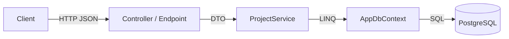

## 1. Introduction

In the previous lessons we saw [how HTTP works](/informatica/web-api/0_http-client-server) and [how to design a REST API](/informatica/web-api/1_rest-api-design). Now we build one with **ASP.NET Core**, the cross-platform web framework of .NET.

We create a small API for engineering projects (`Project`, `Document`, `Equipment`), covering controllers vs minimal APIs, routing, model binding, DTOs, validation, results, DI + EF Core and Swagger.

## 2. Creating the project

```bash
dotnet new webapi -n Projects.Api --use-controllers
cd Projects.Api
dotnet add package Npgsql.EntityFrameworkCore.PostgreSQL   # also brings in EF Core
dotnet run
```

Without `--use-controllers` the template uses minimal APIs. The whole app starts from `Program.cs`:

```cs
var builder = WebApplication.CreateBuilder(args);

// 1. Register services (DI container)
builder.Services.AddControllers();
builder.Services.AddEndpointsApiExplorer();
builder.Services.AddSwaggerGen();

var app = builder.Build();

// 2. Configure the HTTP pipeline (middleware)
if (app.Environment.IsDevelopment())
    app.UseSwagger().UseSwaggerUI();
app.UseHttpsRedirection();
app.MapControllers();
app.Run();
```

There are two clear phases: first you **register services** on `builder.Services`, then you **build** the app and configure the **request pipeline**. The pipeline is covered in detail in the [next lesson](/informatica/web-api/3_aspnet-core-middleware-security).

<Aside variant="info">
`WebApplication.CreateBuilder` already configures a lot for you: Kestrel (the web server), configuration from `appsettings.json` and environment variables, logging and the DI container. This is called the **generic host**.
</Aside>

## 3. Controllers vs minimal APIs

ASP.NET Core offers two styles to define endpoints.

### 3.1 Controllers

A **controller** is a class that groups related endpoints (**actions**).

```cs
[ApiController]
[Route("api/[controller]")]   // → api/projects
public class ProjectsController : ControllerBase
{
    [HttpGet]
    public IActionResult GetAll() => Ok(new[] { "Ship A", "Plant B" });
    [HttpGet("{id:int}")]
    public IActionResult GetById(int id) => Ok($"Project {id}");
}
```

`ControllerBase` is the base class for APIs (no view support, unlike `Controller` in MVC). The `[ApiController]` attribute enables useful behaviour: automatic 400 responses on invalid models, binding inference and ProblemDetails for errors.

### 3.2 Minimal APIs

**Minimal APIs** define endpoints directly with lambdas, without classes:

```cs
app.MapGet("/api/projects", () => new[] { "Ship A", "Plant B" });
app.MapGet("/api/projects/{id:int}", (int id) => $"Project {id}");
```

You can group endpoints with a shared prefix: `app.MapGroup("/api/projects")`.

| | Controllers | Minimal APIs |
|---|---|---|
| Structure | Classes and attributes | Lambdas / methods mapped in code |
| Boilerplate | More | Less |
| Filters, conventions | Mature, rich | Endpoint filters, growing |
| Performance | Very good | Slightly better |
| Typical use | Large, structured APIs | Microservices, small APIs, new projects |

<Aside variant="tip">
Interview tip: don't say one style is "better". Say: "Controllers are great for big APIs with many conventions and team habits; minimal APIs have less ceremony and are the modern default for small services. Both run on the same routing and DI, so I'm comfortable with either."
</Aside>

## 4. Routing

**Routing** maps an incoming URL and HTTP method to an endpoint. ASP.NET Core uses **endpoint routing**; with controllers you normally use **attribute routing**.

```cs
[ApiController]
[Route("api/projects/{projectId:int}/documents")]
public class DocumentsController : ControllerBase
{
    [HttpGet]                      // GET api/projects/5/documents
    public IActionResult List(int projectId) => Ok();

    [HttpGet("{documentId:int}")]  // GET api/projects/5/documents/12
    public IActionResult Get(int projectId, int documentId) => Ok();
}
```

The `:int` part is a **route constraint**. If the value is not an integer, the route doesn't match and the client gets 404. Other constraints: `guid`, `alpha`, `min(1)`, `length(3,20)`.

<Aside variant="warning">
Route constraints are for **matching**, not for input validation. Use `{id:int}` to choose the right endpoint, but validate business rules (for example "the project must exist") in your code and return 404 or 400 yourself.
</Aside>

## 5. Model binding

**Model binding** takes data from the HTTP request and converts it into the parameters of your action. Sources:

| Attribute | Source | Example |
|---|---|---|
| `[FromRoute]` | URL segment | `/api/projects/5` |
| `[FromQuery]` | Query string | `?page=2&status=Active` |
| `[FromBody]` | Request body (JSON) | POST payload |
| `[FromHeader]` | HTTP header | `X-Correlation-Id` |
| `[FromServices]` | DI container | a service |

With `[ApiController]` (and in minimal APIs) the source is usually **inferred**: simple types come from route/query, complex types from the body.

```cs
[HttpGet] // GET api/projects?status=Active&page=2
public IActionResult Search([FromQuery] string? status, [FromQuery] int page = 1)
    => Ok(new { status, page });
```

## 6. DTOs vs entities

An **entity** is the class mapped to a database table by EF Core. A **DTO** (Data Transfer Object) is the class that travels over HTTP. Keep them separate.

```cs
// Entity (database)
public class Project
{
    public int Id { get; set; }
    public string Code { get; set; } = "";
    public string Name { get; set; } = "";
    public DateTime CreatedAt { get; set; }
    public List<Document> Documents { get; set; } = [];
}

// DTOs (API contract)
public record ProjectDto(int Id, string Code, string Name);
public record CreateProjectRequest(string Code, string Name);
```

Why DTOs?

- **Security**: the client cannot set fields like `Id` or `CreatedAt` (no **over-posting**).
- **Stable contract**: you can change the database without breaking clients.
- **No cycles**: returning entities with navigation properties can create JSON loops and huge payloads.
- **Shape per use case**: a list endpoint can return less data than a detail endpoint.

<Aside variant="danger">
Never bind a request body directly to an EF entity and call `SaveChanges`. A malicious client could send extra fields (for example `"OwnerId": 1`) and change data they should not touch. This is the classic over-posting / mass-assignment vulnerability.
</Aside>

C# `record` types are perfect for DTOs: immutable, short, with value equality. Mapping can be manual (a small `ToDto()` extension method) or done with a library like Mapster or AutoMapper.

## 7. Validation

With `[ApiController]`, **Data Annotations** on the DTO are checked automatically. If the model is invalid, the framework returns **400 Bad Request** with a `ValidationProblemDetails` body, before your action runs.

```cs
using System.ComponentModel.DataAnnotations;
public record CreateProjectRequest(
    [Required, StringLength(20, MinimumLength = 3)] string Code,
    [Required, MaxLength(200)] string Name);
```

On positional records, put the attributes on the constructor parameters (no `property:` target): MVC validates them and reports errors with the property name.

Response example (simplified):

```json
{ "title": "One or more validation errors occurred.", "status": 400,
  "errors": { "Code": ["The field Code must be a string with a minimum length of 3..."] } }
```

For complex rules (cross-field checks, patterns on codes) many teams use **FluentValidation**, e.g. `RuleFor(x => x.Code).NotEmpty().Matches(...)`.

Note: minimal APIs in .NET 8 don't run Data Annotations validation automatically. You validate manually, use an endpoint filter, or use FluentValidation (.NET 10 adds built-in validation for minimal APIs).

## 8. Returning results

### 8.1 Controllers: ActionResult of T

`ActionResult<T>` lets you return either a value of type `T` (200 OK) or any other result (404, 400...). It also tells Swagger the response type.

```cs
[HttpGet("{id:int}")]
public async Task<ActionResult<ProjectDto>> GetById(int id, CancellationToken ct)
{
    var project = await service.GetAsync(id, ct); // service = injected IProjectService (section 9)
    if (project is null)
        return NotFound();          // 404
    return project;                 // 200 + JSON
}

[HttpPost]
public async Task<ActionResult<ProjectDto>> Create(CreateProjectRequest req, CancellationToken ct)
{
    var created = await service.CreateAsync(req, ct);
    return CreatedAtAction(nameof(GetById), new { id = created.Id }, created); // 201 + Location
}
```

Common helpers: `Ok()`, `Created...()`, `NoContent()`, `BadRequest()`, `NotFound()`, `Conflict()`, `Problem()`.

### 8.2 Minimal APIs: TypedResults

`TypedResults` returns strongly typed results. Combined with `Results<T1, T2>` the compiler and OpenAPI know every possible response.

```cs
static async Task<Results<Ok<ProjectDto>, NotFound>> GetById(
    int id, IProjectService service, CancellationToken ct)
{
    var project = await service.GetAsync(id, ct);
    return project is null
        ? TypedResults.NotFound()
        : TypedResults.Ok(project);
}
```

<Aside variant="tip">
Always accept a `CancellationToken` in async endpoints and pass it down to EF Core. If the client disconnects, ASP.NET Core cancels the token and the database query stops, saving server resources. See [async/await](/informatica/csharp/async-await).
</Aside>

## 9. Wiring DI and EF Core

A typical layering: the endpoint calls a **service**, the service uses the **DbContext**.



```cs
// Program.cs
builder.Services.AddDbContext<AppDbContext>(options =>
    options.UseNpgsql(builder.Configuration.GetConnectionString("Default")));

builder.Services.AddScoped<IProjectService, ProjectService>();
```

```cs
public class ProjectService(AppDbContext db) : IProjectService
{
    public Task<ProjectDto?> GetAsync(int id, CancellationToken ct) =>
        db.Projects
          .AsNoTracking()
          .Where(p => p.Id == id)
          .Select(p => new ProjectDto(p.Id, p.Code, p.Name))
          .FirstOrDefaultAsync(ct);
    public async Task<ProjectDto> CreateAsync(CreateProjectRequest req, CancellationToken ct)
    {
        var project = new Project { Code = req.Code, Name = req.Name, CreatedAt = DateTime.UtcNow };
        db.Projects.Add(project);
        await db.SaveChangesAsync(ct);
        return project.ToDto();
    }
}
```

The controller receives the service through its constructor, e.g. with a C# 12 **primary constructor**: `public class ProjectsController(IProjectService service) : ControllerBase`.

Key points:

- `AddDbContext` registers the `DbContext` as **scoped**: one instance per HTTP request.
- Services that use the `DbContext` must be scoped (or transient), never singleton.
- `Select` into a DTO generates SQL with only the needed columns. `AsNoTracking` makes read-only queries faster.

More details in [Dependency Injection](/informatica/csharp/dependency-injection) and [Entity Framework](/informatica/csharp/orm-entity-framework).

<Aside variant="warning">
Injecting a scoped `DbContext` into a singleton service creates a **captive dependency**: the same context is shared across requests and threads, which is not thread-safe. In Development, ASP.NET Core detects this with scope validation and throws at startup.
</Aside>

## 10. Swagger / OpenAPI

**OpenAPI** is a standard JSON/YAML description of your API. **Swagger UI** is a web page that reads it and lets you try the endpoints. In .NET 8 the template uses **Swashbuckle** (`AddSwaggerGen`, `UseSwagger`, `UseSwaggerUI`, shown in section 2). The JSON document is at `/swagger/v1/swagger.json`, the UI at `/swagger`.

To document responses in controllers, use `[ProducesResponseType]`:

```cs
[ProducesResponseType<ProjectDto>(StatusCodes.Status200OK)]
[ProducesResponseType(StatusCodes.Status404NotFound)]
```

The OpenAPI document is also useful for **integration**: other teams can generate typed clients (C#, TypeScript) from it with tools like NSwag or Kiota.

<Aside variant="info">
Starting with .NET 9, the template uses `Microsoft.AspNetCore.OpenApi` (`AddOpenApi` / `MapOpenApi`) instead of Swashbuckle. The idea is the same: generate an OpenAPI document from your endpoints.
</Aside>

## 11. Interview questions

**Q: What is the difference between controllers and minimal APIs?**
Both are built on the same routing, DI and middleware. Controllers group actions in classes and use attributes, filters and conventions, which works well for large APIs. Minimal APIs map endpoints with lambdas and have less boilerplate. I would pick based on the size of the project and the team's existing conventions.

**Q: Why should you use DTOs instead of returning EF entities?**
DTOs decouple the API contract from the database model, so I can change the schema without breaking clients. They also prevent over-posting, because the client can only send the fields I expose. Finally, they avoid serialization problems like cycles in navigation properties and let me return only the data each endpoint needs.

**Q: What does the ApiController attribute do?**
It enables API-specific behaviour: automatic model validation with a 400 ProblemDetails response, inference of binding sources like body and route, and the requirement of attribute routing. It removes a lot of repetitive code like checking `ModelState.IsValid` in every action.

**Q: What is model binding?**
Model binding reads values from the request, such as route segments, query string, headers and JSON body, and converts them into the typed parameters of my action. I can control the source with attributes like `[FromQuery]` or `[FromBody]`. If conversion fails, the model state becomes invalid.

**Q: What is the lifetime of a DbContext in ASP.NET Core and why?**
By default it is scoped, so there is one instance per HTTP request. A DbContext is not thread-safe and tracks entities, so sharing it between requests would cause bugs. Because of this, any service that depends on it should also be scoped.

**Q: What status code do you return when creating a resource?**
I return 201 Created, with a `Location` header pointing to the new resource and usually the created object in the body. In controllers I use `CreatedAtAction`, in minimal APIs `TypedResults.Created`.

**Q: How do you validate input in an ASP.NET Core API?**
For simple rules I use Data Annotations on DTOs, which `[ApiController]` checks automatically. For more complex rules I use FluentValidation. Business rules that need the database, like a unique project code, I check in the service layer and return 409 Conflict or 400 with ProblemDetails.

## 12. Quiz

import Quiz from '../../../components/Quiz.jsx';

<Quiz client:load questions={[
{
question:"Which base class should an API controller inherit from?",
answers:{ a:"Controller", b:"ApiBase", c:"ControllerBase", d:"PageModel" },
correctAnswer:"c"
},
{
question:"What happens with `[ApiController]` when the request body fails Data Annotations validation?",
answers:{ a:"The framework automatically returns 400 with ValidationProblemDetails", b:"The action runs and ModelState is ignored", c:"The server returns 500 Internal Server Error", d:"The invalid fields are set to null silently" },
correctAnswer:"a"
},
{
question:"In the route template `{id:int}`, what is `:int`?",
answers:{ a:"A validation attribute that returns 400", b:"A route constraint used for matching", c:"A type cast executed in the action", d:"A query string parameter" },
correctAnswer:"b"
},
{
question:"What is the main security risk of binding request bodies directly to EF entities?",
answers:{ a:"SQL injection", b:"Cross-site scripting", c:"Slower JSON serialization", d:"Over-posting (mass assignment)" },
correctAnswer:"d"
},
{
question:"What is the default lifetime of a DbContext registered with `AddDbContext`?",
answers:{ a:"Singleton", b:"Scoped", c:"Transient", d:"Static" },
correctAnswer:"b"
},
{
question:"Which helper returns 201 Created with a Location header in a controller?",
answers:{ a:"Ok()", b:"NoContent()", c:"CreatedAtAction()", d:"Accepted()" },
correctAnswer:"c"
},
{
question:"What is the advantage of `Results<Ok<ProjectDto>, NotFound>` in minimal APIs?",
answers:{ a:"The possible responses are known at compile time and documented in OpenAPI", b:"It makes the endpoint run faster on the database", c:"It enables automatic authentication", d:"It caches the response" },
correctAnswer:"a"
},
{
question:"Why do you pass a `CancellationToken` to EF Core methods in an endpoint?",
answers:{ a:"To make the query use a transaction", b:"To enable change tracking", c:"To retry the query on failure", d:"To stop the database work if the client disconnects" },
correctAnswer:"d"
}
]} />

## 13. Exercises

### 13.1 Equipment CRUD with controllers

**Goal**: build a full CRUD API for `Equipment` (Id, Tag, Description, ProjectId).

1. Create the entity and add a `DbSet<Equipment>` to `AppDbContext` (PostgreSQL with `UseNpgsql`).
2. Create `EquipmentDto`, `CreateEquipmentRequest` and `UpdateEquipmentRequest` records with Data Annotations.
3. Create `IEquipmentService` / `EquipmentService` (scoped) and an `EquipmentController` with GET list, GET by id, POST, PUT and DELETE.
4. Return the correct status codes: 200, 201, 204, 404.
5. Test everything from Swagger UI.

*Hint*: for PUT and DELETE return `NoContent()` on success and `NotFound()` if `FindAsync` returns null.

### 13.2 The same API with minimal APIs

**Goal**: compare the two styles.

1. Rewrite the Equipment endpoints using `MapGroup("/api/equipment")`.
2. Use `TypedResults` and `Results<...>` for every handler.
3. Move the handlers into a static class `EquipmentEndpoints` with an extension method `MapEquipmentEndpoints(this IEndpointRouteBuilder app)`.
4. Write down three differences you noticed compared to the controller version.

*Hint*: services like `IEquipmentService` are injected directly as handler parameters.

### 13.3 Nested resources with filtering

**Goal**: expose documents of a project: `GET /api/projects/{projectId}/documents?status=Approved&page=1&pageSize=20`.

1. Add a `Document` entity (Id, Number, Title, Revision, Status, ProjectId).
2. Bind `projectId` from the route and `status`, `page`, `pageSize` from the query string.
3. Return 404 if the project does not exist.
4. Apply `Where`, `OrderBy`, `Skip` and `Take`, projecting to a DTO.
5. Return a paged response with `items` and `totalCount`.

*Hint*: run `CountAsync` before `Skip`/`Take`, and limit `pageSize` to a maximum (for example 100).
