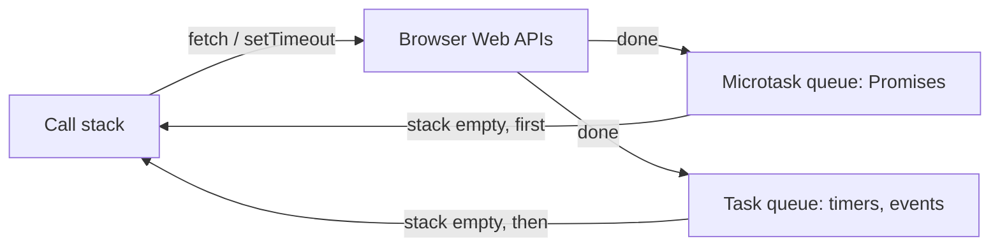

## 1. Introduction

As a .NET developer you will often build the **server** side of a web app. But the **client** (the browser) runs **JavaScript**, and sooner or later you will need to read it, debug it, or write a small page that calls your API. This lesson covers the parts of modern JavaScript (ES2015 to ES2022) that matter most for a backend developer: variables, functions, objects, modules, the **event loop**, **Promises**, `async`/`await`, and `fetch`. Where it helps, we compare with C#.

| Concept | C# | JavaScript |
|---|---|---|
| Typing | static, compiled | dynamic, interpreted / JIT |
| Async result | `Task<T>` | `Promise` |
| Lambda | `x => x * 2` | `x => x * 2` |
| Collections | LINQ (`Select`, `Where`) | array methods (`map`, `filter`) |
| Null-safe access | `obj?.Name` | `obj?.name` |
| Threads | thread pool, many threads | one main thread + event loop |

If you want static types on top of JavaScript, look at **TypeScript**: it compiles to plain JavaScript and feels much closer to C#. Start from the [TypeScript introduction](/informatica/typescript/0_introduction).

## 2. Variables: `let`, `const` and `var`

Modern code uses only `const` and `let`:

- **`const`**: the variable cannot be reassigned. Use it by default.
- **`let`**: the variable can be reassigned. Use it only when needed.
- **`var`**: old style, **function-scoped** instead of **block-scoped**. Avoid it.

```js
const projectId = 42;
let status = "Draft";
status = "Approved";      // OK
// projectId = 43;        // TypeError: Assignment to constant variable

const tag = { code: "P-101" };
tag.code = "P-102";       // OK: the object is mutable, the binding is not
```

<Aside variant="warning">
`const` is not the same as C# `readonly` on the whole object. It only blocks reassignment of the variable. The object it points to can still change. Use `Object.freeze()` if you need a shallow immutable object.
</Aside>

Also remember: `==` converts types before comparing (`"1" == 1` is `true`), while `===` compares value **and** type. Always use `===` and `!==`.

## 3. Functions and arrow functions

```js
function formatTag(tag) {                           // function declaration
  return `${tag.prefix}-${tag.number}`;             // template literal
}
const isOpen = (doc) => doc.status !== "Closed";    // arrow function (like a C# lambda)
const pageUrl = (page = 1, size = 20) => `/api/documents?page=${page}&size=${size}`;
```

**Template literals** use backticks and `${...}` placeholders, like C# string interpolation `$"Rev {rev}"`.

**Arrow functions** are short, and they do not have their own `this`: they capture `this` from the surrounding code. This makes them perfect for callbacks, for example `data.forEach((d) => this.items.push(d))` inside a class method.

## 4. Objects, arrays, destructuring and spread

### 4.1 Destructuring

**Destructuring** extracts values from objects or arrays into variables.

```js
const doc = { id: 7, title: "P&ID Unit 100", revision: "B", owner: { name: "Anna" } };

const { title, revision } = doc;          // object destructuring
const { owner: { name: ownerName } } = doc; // nested + rename
const [first, second] = ["A", "B", "C"];  // array destructuring
function describe({ title, revision = "A" }) {
  return `${title} (rev ${revision})`;
}
```

### 4.2 Spread and rest

The `...` operator **spreads** (copies) or **collects** (rest) values.

```js
const updated = { ...doc, revision: "C" };     // shallow copy + override
const allTags = [...pumpTags, ...valveTags];   // merge arrays
const logAll = (level, ...messages) => messages.forEach((m) => console.log(level, m)); // rest
```

### 4.3 Optional chaining and nullish coalescing

```js
const city = project.site?.address?.city;        // undefined instead of an error
const pageSize = settings.pageSize ?? 20;        // default only for null/undefined
```

Note the difference: `0 || 20` gives `20`, but `0 ?? 20` gives `0`. Use `??` for default values.

### 4.4 Array methods vs LINQ

```js
const equipment = [
  { tag: "P-101", type: "Pump", weightKg: 850 },
  { tag: "V-201", type: "Vessel", weightKg: 4200 },
  { tag: "P-102", type: "Pump", weightKg: 900 },
];

const pumpTags = equipment
  .filter((e) => e.type === "Pump")        // Where
  .map((e) => e.tag);                      // Select

const totalWeight = equipment.reduce((sum, e) => sum + e.weightKg, 0); // Aggregate / Sum
const vessel = equipment.find((e) => e.type === "Vessel");             // FirstOrDefault
```

<Aside variant="warning">
JavaScript array methods are **eager**: each `map` or `filter` creates a new array immediately. LINQ on `IEnumerable` is **lazy** (deferred execution). For a few thousand items in the browser this does not matter.
</Aside>

## 5. Modules

**ES modules** split code into files. Each file has its own scope; you choose what to `export`.

```js
// api/documents.js
export const BASE_URL = "/api";
export async function getDocuments() { /* ... */ }
export default class DocumentClient { /* ... */ }

// main.js
import DocumentClient, { getDocuments, BASE_URL } from "./api/documents.js";
```

In the browser you load the entry file with `<script type="module" src="main.js"></script>`. Modules are a bit like C# namespaces plus `public`/`internal`: anything not exported stays private to the file. In older Node.js code you may see **CommonJS** (`require(...)`) instead.

## 6. JSON

**JSON** (JavaScript Object Notation) is the standard format for REST APIs. JavaScript converts it natively:

```js
const json = JSON.stringify({ id: 7, title: "Layout", tags: ["P-101"] });
// '{"id":7,"title":"Layout","tags":["P-101"]}'

const obj = JSON.parse(json);
console.log(obj.tags[0]); // "P-101"
```

<Aside variant="info">
ASP.NET Core serializes C# properties in **camelCase** by default. So `public string ProjectName` in your DTO becomes `projectName` in JavaScript. Also, JSON has no date type: a `DateTime` arrives as an ISO string, so convert it with `new Date(value)`.
</Aside>

## 7. The event loop

JavaScript in the browser runs on **one main thread**. It cannot block while waiting for a network call, otherwise the page would freeze. Instead it uses the **event loop**: the **call stack** runs synchronous code, slow operations (network, timers) run in the background, and their callbacks wait in a **queue**. When the stack is empty, the loop runs the next callback. Promise callbacks go into the **microtask queue**, which has priority over the **task queue** (timers, events).



```js
console.log("1");
setTimeout(() => console.log("2"), 0);
Promise.resolve().then(() => console.log("3"));
console.log("4");
// Output: 1, 4, 3, 2
```

<Aside variant="tip">
Interview tip: this "guess the output" snippet is a classic question. Explain it in three steps: synchronous code first (1, 4), then microtasks (3), then tasks like timers (2).
</Aside>

## 8. Promises

A **Promise** represents a value that will be available in the future. It has three states: **pending**, **fulfilled**, or **rejected**. It is the JavaScript equivalent of `Task<T>`.

```js
fetch("/api/projects")
  .then((response) => response.json())
  .then((projects) => console.log(projects.length))
  .catch((error) => console.error("Failed:", error))
  .finally(() => console.log("Done"));
```

Running several Promises together:

```js
// Wait for all (like Task.WhenAll). Rejects if one fails.
const [projects, users] = await Promise.all([getProjects(), getUsers()]);
// Never rejects: you get a status for each one
const results = await Promise.allSettled([getProjects(), getUsers()]);
```

`Promise.race` returns the first one to finish, like `Task.WhenAny`.

## 9. `async` / `await`

`async`/`await` is syntax on top of Promises, just like in C#. An `async` function **always returns a Promise**. `await` pauses the function (not the thread) until the Promise settles.

```js
async function loadProject(id) {
  const response = await fetch(`/api/projects/${id}`);
  return await response.json();  // the caller receives a Promise
}

const project = await loadProject(42); // top-level await works in modules
```

| C# | JavaScript |
|---|---|
| `async Task<Project> LoadAsync()` | `async function load()` |
| `await Task.WhenAll(a, b)` | `await Promise.all([a, b])` |
| `CancellationToken` | `AbortController` / `AbortSignal` |

<Aside variant="danger">
Do not `await` inside a loop when calls are independent: `for (const id of ids) await getDoc(id)` runs them one by one. Start them all and use `Promise.all(ids.map(getDoc))` instead. Also, forgetting `await` gives you a Promise object, not the data.
</Aside>

For the C# side, see [async/await in C#](/informatica/csharp/async-await).

## 10. Calling the REST API with `fetch`

`fetch` is the built-in HTTP client of the browser. The most important rule: **`fetch` rejects only on network errors**. A `404` or `500` response is still a "successful" Promise. You must check `response.ok` yourself.

### 10.1 A small API helper

```js
const BASE_URL = "https://localhost:5001/api";

export async function apiRequest(path, { method = "GET", body, timeoutMs = 10000 } = {}) {
  const response = await fetch(`${BASE_URL}${path}`, {
    method,
    headers: {
      "Content-Type": "application/json",
      Authorization: `Bearer ${localStorage.getItem("token")}`,
    },
    body: body ? JSON.stringify(body) : undefined,
    signal: AbortSignal.timeout(timeoutMs),   // cancel if too slow
  });

  if (response.status === 204) return null;   // No Content

  const data = await response.json().catch(() => null);
  if (!response.ok) {
    // ASP.NET Core returns ProblemDetails: { title, status, detail, errors }
    const message = data?.title ?? response.statusText;
    throw Object.assign(new Error(message), { status: response.status, problem: data });
  }
  return data;
}
```

In a bigger project you would create an `ApiError` class that extends `Error`, like a custom exception in C#.

### 10.2 Using the helper

```js
// GET with query string
const params = new URLSearchParams({ status: "Approved", page: 1 });
const docs = await apiRequest(`/projects/42/documents?${params}`);

// POST a new revision
try {
  const rev = await apiRequest("/documents/7/revisions", {
    method: "POST",
    body: { code: "C", description: "Updated pump P-101 data" },
  });
  console.log("Created revision", rev.id);
} catch (err) {
  if (err.status === 400) {
    console.warn("Validation errors:", err.problem?.errors);
  } else {
    throw err;
  }
}
```

<Aside variant="warning">
If the page and the API have different origins (for example `localhost:5173` and `localhost:5001`), the browser blocks the call unless the API sends the right **CORS** headers. This is configured on the server: see [Middleware, Error Handling and Security](/informatica/web-api/3_aspnet-core-middleware-security).
</Aside>

## 11. Updating the DOM

The **DOM** (Document Object Model) is the tree of HTML elements that JavaScript can read and change. Frameworks like React or Angular do this for you, but the basics are simple. Assume the page has an input `#search`, a list `#equipment-list` and a hidden paragraph `#error`.

```js
const list = document.querySelector("#equipment-list");
const errorBox = document.querySelector("#error");

function render(items) {
  list.replaceChildren(...items.map((e) => {
    const li = document.createElement("li");
    li.textContent = `${e.tag} - ${e.type}`;   // safe: no HTML parsing
    return li;
  }));
}

document.querySelector("#search").addEventListener("input", async (event) => {
  try {
    errorBox.hidden = true;
    const q = encodeURIComponent(event.target.value);
    render(await apiRequest(`/equipment?tag=${q}`));
  } catch (err) {
    errorBox.textContent = `Error: ${err.message}`;
    errorBox.hidden = false;
  }
});
```

<Aside variant="danger">
Never put API data into `innerHTML` without escaping it. If a document title contains a `script` tag or an `onerror` attribute, you create an **XSS** (Cross-Site Scripting) vulnerability. Use `textContent` for text.
</Aside>

## 12. Interview questions

**Q: What is the difference between `let`, `const` and `var`?**
`let` and `const` are block-scoped, while `var` is function-scoped and is hoisted, which causes subtle bugs. I use `const` by default and `let` only when I need to reassign. I never use `var` in modern code.

**Q: How does JavaScript handle asynchronous code if it is single-threaded?**
It uses the event loop. Slow work like network calls is handled by the browser or by Node.js in the background, and when it finishes, a callback is put in a queue. When the call stack is empty, the event loop runs the next callback, with Promise microtasks taking priority over timers.

**Q: What is a Promise, and how does it compare to a C# Task?**
A Promise is an object that represents a future value, and it can be pending, fulfilled or rejected. It is very similar to `Task<T>`: you can await it, chain it, and combine several with `Promise.all`, which is like `Task.WhenAll`. One difference is that there is no built-in cancellation token, so for `fetch` we use an `AbortController`.

**Q: Does `fetch` throw an error on a 404 or 500 response?**
No, `fetch` only rejects on network failures, like a DNS error or a CORS block. For HTTP errors the Promise resolves normally, so I always check `response.ok` or the status code and throw my own error. I usually wrap this in a small helper that also parses the ProblemDetails body.

**Q: How do arrow functions differ from normal functions?**
They are shorter, and they do not have their own `this`, `arguments` or `prototype`. They take `this` from the surrounding scope, which is useful in callbacks and event handlers inside classes. Because of that, they are not good as object methods that need their own `this`.

**Q: As a backend developer, how do you make sure the front end and the API work well together?**
I agree on a clear contract, ideally with an OpenAPI spec, consistent camelCase JSON, and standard error responses with ProblemDetails. I configure CORS correctly on the server and return the right status codes, so the client can handle errors in a predictable way. Sometimes we generate a typed TypeScript client from the OpenAPI file.

## 13. Quiz

import Quiz from '../../../components/Quiz.jsx';

<Quiz client:load questions={[
{
question:"What is printed by: console.log('A'); setTimeout(() => console.log('B'), 0); Promise.resolve().then(() => console.log('C')); console.log('D');",
answers:{ a:"A, B, C, D", b:"A, D, B, C", c:"A, D, C, B", d:"A, C, D, B" },
correctAnswer:"c"
},
{
question:"Your API returns HTTP 404. What does `await fetch(url)` do?",
answers:{ a:"It throws a TypeError", b:"It resolves with a Response where `ok` is false", c:"It returns null", d:"It retries the request automatically" },
correctAnswer:"b"
},
{
question:"Which statement about `const` is correct?",
answers:{ a:"The object it points to becomes immutable", b:"It is function-scoped like `var`", c:"It can be reassigned inside a block", d:"The variable cannot be reassigned, but the object can still change" },
correctAnswer:"d"
},
{
question:"Which is the JavaScript equivalent of C# `Task.WhenAll`?",
answers:{ a:"`Promise.all`", b:"`Promise.race`", c:"`Promise.resolve`", d:"`setTimeout`" },
correctAnswer:"a"
},
{
question:"What is the value of `0 ?? 20`?",
answers:{ a:"20", b:"0", c:"undefined", d:"null" },
correctAnswer:"b"
},
{
question:"A C# DTO has the property `ProjectName`. With default ASP.NET Core settings, how do you read it in JavaScript?",
answers:{ a:"`data.ProjectName`", b:"`data.project_name`", c:"`data.projectName`", d:"`data['Project Name']`" },
correctAnswer:"c"
},
{
question:"Why should you prefer `textContent` over `innerHTML` for API data?",
answers:{ a:"It is the only way to show text", b:"It prevents XSS because the text is not parsed as HTML", c:"It is required by CORS", d:"It makes the request faster" },
correctAnswer:"b"
},
{
question:"Which JavaScript array method is the closest to LINQ `Where`?",
answers:{ a:"`map`", b:"`reduce`", c:"`find`", d:"`filter`" },
correctAnswer:"d"
}
]} />

## 14. Exercises

### 14.1 Equipment report with array methods

**Goal**: practice destructuring and array methods on engineering data.

1. Create an array of 6 equipment objects with `tag`, `type`, `weightKg` and `projectId`.
2. Use `filter` and `map` to get the tags of all pumps.
3. Use `reduce` to build an object that groups the total weight by `type`.

*Hint: in `reduce`, start from an empty object and use `acc[e.type] = (acc[e.type] ?? 0) + e.weightKg`.*

### 14.2 A robust API client

**Goal**: write a reusable `fetch` wrapper for your ASP.NET Core API.

1. Create a module `api.js` that exports `apiRequest(path, options)` and an `ApiError` class that extends `Error`.
2. Throw `ApiError` for every non-2xx response, including the ProblemDetails body.
3. Load projects and users in parallel with `Promise.all`, with a 5-second timeout (`AbortSignal.timeout`).

*Hint: test the error path by calling a URL that does not exist and checking `err.status === 404`.*

### 14.3 Document list page

**Goal**: build a small HTML page that shows the documents of a project.

1. Create `index.html` with a list, a search input and an error box, and load `main.js` as a module.
2. On page load, call `GET /api/projects/{id}/documents` and render title and current revision with `textContent`.
3. Add a search input that filters by title (300 ms debounce) and show a friendly message when the API fails.

*Hint: a simple debounce uses `clearTimeout` and `setTimeout` inside the event listener. Remember to enable CORS on the API for your dev server origin.*
